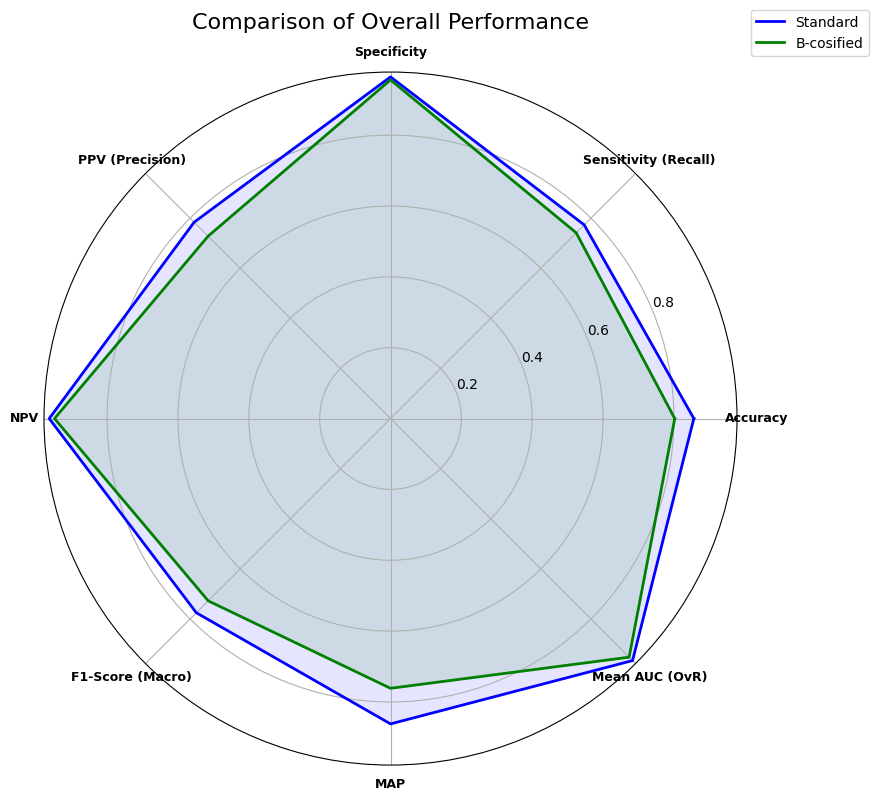
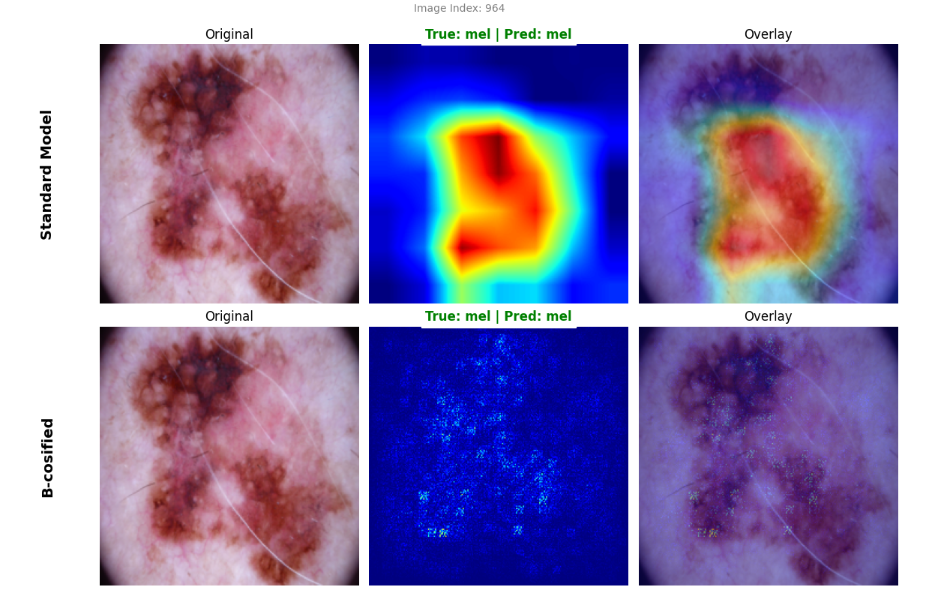

# **XAI for Skin Cancer Classification**
### *via B-cosification*

**Authors:** Tommaso Federici & Lucia Fornetti

---

## **Abstract & Motivation**
Deep Learning has revolutionized medical imaging, achieving superhuman accuracy in diagnostic tasks. However, the clinical adoption of these models is often hindered by the **"Black Box" problem**: standard neural networks are opaque, making their decisions difficult for medical professionals to trust and verify.

In this project, we explore **Explainable AI (XAI)** applied to **Skin Cancer Classification**. Rather than relying solely on post-hoc explanation methods (i.e. Grad-CAM), we implement the **B-cosification** technique. This approach transforms standard neural networks into *inherently interpretable* models, aligning the model's decision-making process with human-understandable visual evidence.

### **The Challenge: The "Black Box" in Medicine**
Medical professionals cannot blindly trust the output of an AI model, regardless of its statistical accuracy. Standard Convolutional Neural Networks (CNNs) operate as **"Black Boxes"**: while they achieve state-of-the-art performance, they fail to provide explanations that are both **faithful** (truly reflecting the model's reasoning) and **interpretable** (visually understandable by humans).

* **The Goal:** To design a **White-Box** model that matches the high classification performance of standard baselines while providing explanations that are **inherently faithful** to the decision process and **easily interpretable** by dermatologists.

### **Project Objectives**
We compare two approaches using the **HAM10000** dataset (7 diagnostic categories):

1.  **Baseline Model (ResNet50):** A standard deep learning backbone optimized for pure classification performance.
2.  **B-cos Model (B-cosification):** A modified ResNet50 that replaces linear transformations with B-cos operators, enforcing high interpretability without significant loss in accuracy.

---
## **Evaluation**

### **Strategy & Metrics**

To rigorously assess the performance of our models, we adopt the evaluation protocols established by the **ISIC 2018 Challenge (Task 3: Lesion Diagnosis)**. Given the high class imbalance of the HAM10000 dataset (where *Melanocytic Nevi* dominate), standard accuracy is an insufficient metric.

We employ a multi-faceted evaluation strategy focusing on three key pillars:

1.  **Clinical Safety (Sensitivity):** In dermatology, a False Negative (missing a melanoma) is far worse than a False Positive. We prioritize high **Recall (Sensitivity)** on malignant classes.
2.  **Class-Imbalance Robustness:** We utilize **Macro-Averaged** metrics (F1-Score, AUC) which treat all classes equally, preventing the majority class from masking poor performance on rare lesions (like *Dermatofibroma*).
3.  **Explainability (Qualitative):** Beyond numbers, we evaluate the **faithfulness** of the model's focus using heatmaps.

#### **Selected Metrics (ISIC 2018 Compliant):**
* **Balanced Accuracy:** The arithmetic mean of sensitivity and specificity. This was the primary ranking metric for the ISIC 2018 challenge.
* **Macro F1-Score:** The harmonic mean of Precision and Recall, computed per class and averaged.
* **AUC (One-vs-Rest):** Measures the model's ability to distinguish between classes across all decision thresholds.
* **Specificity & NPV:** To ensure benign lesions are correctly identified, reducing unnecessary biopsies.

### **Results**
We evaluated the models on an unseen Test Set. The comparison highlights the inherent trade-off between pure accuracy and model transparency.

| Metric Category | Metric | Standard Model | B-cos Model |
| :--- | :--- | :---: | :---: |
| **Overall** | **Accuracy** | 85.63% | 80.24% |
| | **Macro F1-Score** | 77.52% | 72.78% |
| | **MAP (Mean Avg Precision)** | 86.20% | 76.15% |
| **Clinical** | **Sensitivity (Recall)** | 77.33% | 74.14% |
| | **Specificity** | 96.45% | 95.60% |
| | **PPV (Precision)** | 78.39% | 72.82% |
| | **NPV (Neg. Pred. Value)** | 96.34% | 94.85% |
| **Probabilistic** | **Mean AUC (OvR)** | 96.62% | 95.26% |
| | **Binary AUC (Mal vs Ben)** | 0.9427 | 0.9215 |
| | **pAUC (Sensitivity ≥ 80%)** | 0.8926 | 0.8331 |

> **Observation:** While the B-cos model shows a moderate drop in accuracy (~5%), it maintains a strong **AUC (>0.92)** for malignancy detection, making it a viable candidate for "Human-in-the-loop" diagnostic support where trust is paramount.

## **Visual Explanations: The "Glass Box" Advantage**
Unlike post-hoc methods (like Grad-CAM) which only highlight *where* the model is looking, **B-cosification** provides inherently faithful explanations that resemble feature segmentation.

### **Comparison: Standard vs. B-cosified**

* **Standard Model (Grad-CAM):** Produces vague, blob-like heatmaps. It answers "Where?" but not "What?".
* **B-cos Model:** Highlights specific morphological features (e.g., irregular borders, pigment networks) with pixel-level precision. It provides a verifiable medical rationale.

## **References**
* **Dataset:** [HAM10000 (Human Against Machine)](https://www.kaggle.com/datasets/kmader/skin-cancer-mnist-ham10000)
* **Method:** Arya et al., *"B-cosification: Transforming Deep Neural Networks to be Inherently Interpretable"* ([GitHub](https://github.com/shrebox/B-cosification))
* **Architecture:** ResNet50 (He et al., 2016)

